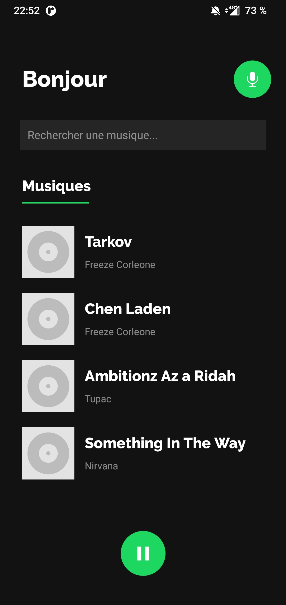

# Application Remake Spotify Mobile

*Application développée dans le cadre du master ILSEN au CERI, Université d'Avignon*

Projet Middleware Ice &amp; Soup : application de streaming musical basée sur une architecture distribuée, la librairie VLC et sur le middleware Ice, par Zeroc
Gestion des serveurs effectuée au moyen d'IceGrid.

# Fonctionnalités de l'application

## Streaming

Tout comme Spotify, l'application permet de lire un flux audio de streaming et de le contrôler au moyen du bouton play/pause.

## Commandes vocales

L'application permet également à l'utilisateur d'énoncer des commandes vocales, telles que : "Lance [Musique] de [Artiste] s'il te plaît", "Monte encore un peu le son", "Mets la musique pause", etc...

# Architecture du projet

- Back : Python
- SGBD : SQLite
- Front : Java, Android natif
- Reconnaissance vocale : Google Speech to Text
- Analyseur de requête : module python TextBlob, qui utilise notamment la classification de texte supervisé

# Screenshots

  

